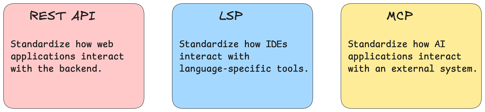
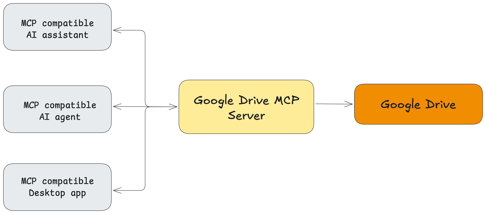
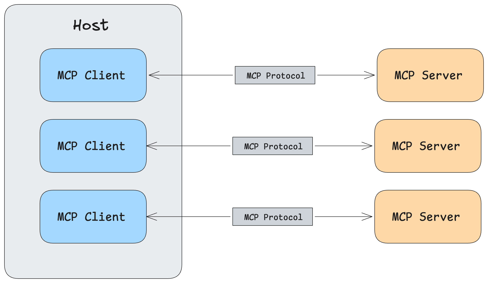
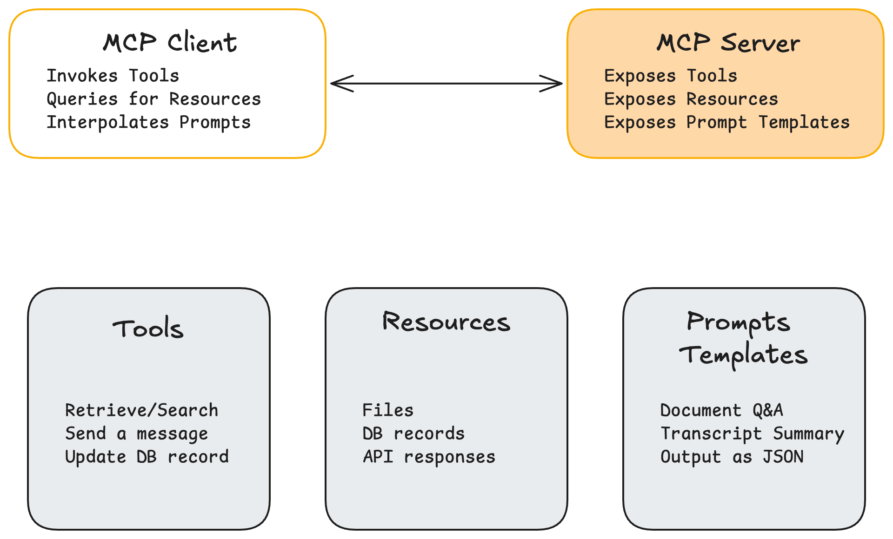
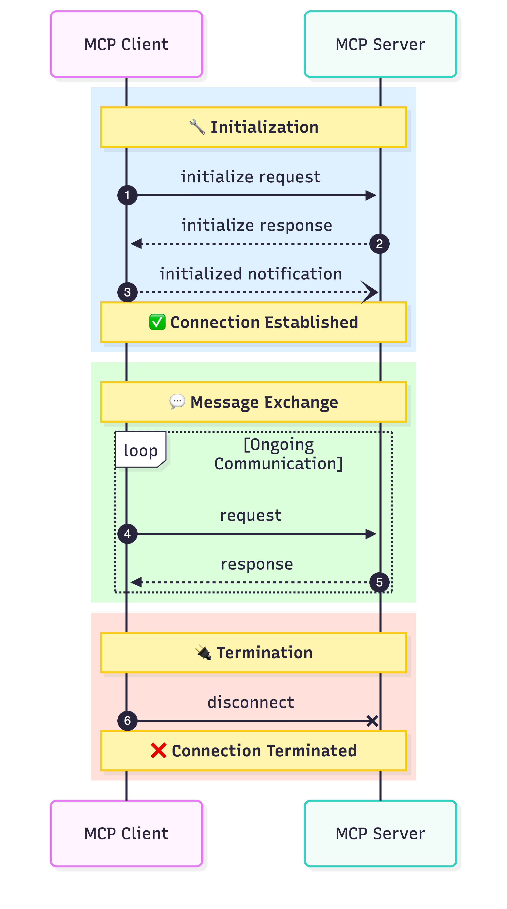

# Model Context Protocol (MCP)

**Useful Links:**
- [Official Documentation](https://modelcontextprotocol.io/docs/getting-started/intro)
- [MCP Servers List](https://mcp.so/)
- [Google Cloud: What is the MCP and how does it work?](https://cloud.google.com/blog/products/ai-machine-learning/what-is-the-model-context-protocol)

## Why MCP?

**Models are only as good as the context they have.**

**The Problem: Fragmented AI development**
Historically, many AI applications were talking to the same data sources but doing so with custom, one-off implementations. Every new data source or tool meant writing new integration code.

**The Solution:**
MCP standardizes how your LLM applications connect and work with your tools and data sources. It provides a universal, open standard for AI-to-tool communication.

## Benefits

- **Zero Additional Work:** Connect your app to any MCP server with 0 additional work.
- **Universal Adoption:** Build an MCP server once, and it can be adopted anywhere.
- **Extended Capabilities:** AI applications gain extended capabilities instantly.
- **Separation of Concerns:** Clearly separates the AI logic (client/host) from the data access logic (server).
- **Proven Concepts:** Borrows a lot of ideas from other established protocols.
- **Reusability:** MCP servers are highly reusable by various applications.

---

## MCP Architecture

MCP is similar to other client-server architectures. 

- **Host:** LLM applications that want to access external data via MCP (e.g., Claude Desktop, IDEs like Cursor, custom AI agents).
- **MCP Clients:** These live inside the host application. MCP clients maintain a one-to-one (1:1) connection with MCP servers.
- **MCP Servers:** Lightweight programs that each expose specific capabilities via the MCP protocol.

---

## How does it work?

The MCP server exposes three main primitives to the client:

1. **Tools:** Functions and tools that can be invoked by the client.
   - *Examples:* Retrieve/search data, send a message, update a DB record.
2. **Resources:** Read-only data exposed by the server.
   - *Examples:* Files, DB records, API responses.
   - Resources are dynamic, meaning they can be updated as data changes in the application.
3. **Prompt Templates:** Pre-defined templates for AI interactions.
   - *Purpose:* Take the burden off the user.
   - *Examples:* Document Q&A, Transcript Summary, JSON output formatting.

**The Flow:**
- The **MCP Client** invokes tools, queries for resources, and interpolates prompts.
- The **MCP Server** exposes these tools, resources, and prompt templates.

---

## MCP Communication Lifecycle

The lifecycle of an MCP connection consists of three main phases:

1. **Initialization:**
   - MCP client sends an `initialize` request.
   - MCP server sends back an `initialize` response.
   - MCP client sends an `initialized` notification.
   - *Connection is established.*
2. **Message Exchange:**
   - The MCP client sends requests and receives responses from the MCP server.
3. **Termination:**
   - The connection is cleanly terminated.

---

## MCP Transports

A transport handles the underlying mechanics of how messages are sent and received between the client and the server.

- **For Local Servers:**
  - **`stdio`** (Standard Input/Output): Best for secure, local execution where the server runs as a subprocess of the host.
- **For Remote Servers:**
  - **HTTP / SSE** (Server-Sent Events)
  - **Streamable HTTP:** Recommended going forward. It supports both stateful connections (remembering previous interactions) and stateless connections (independent requests).
